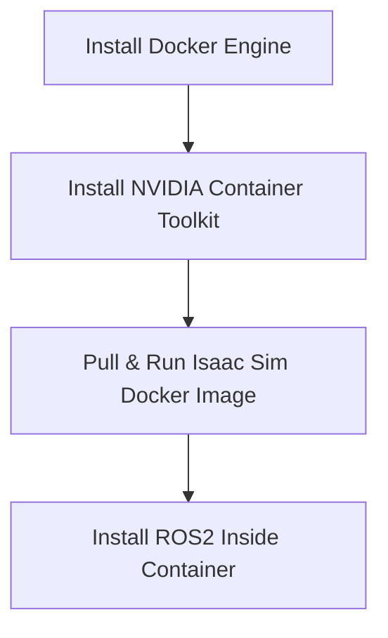

<hr>
- [previous post]( /posts/Integration_of_the_(FRcobot_robotic_arm)_with_the_2F_85_end_effector1/ )

<br>

## Step 5: URDF Rendering in Isaac Sim

- First, let's launch Isaac Sim

```bash
cd /isaac-sim
./runapp.sh
```

_Initial screen_

- File - Import

- choose 

``` /workspace/robot_ws/src/frcobot_ros2/fairino_description/urdf/fairino_with_robotiq.urdf ```


_Configure it like this_

**then, import**

<br>

and ```create - physics - ground plane```


<br>
<hr>

## Step 6: Isaac-sim Environment Setting


<br>
<hr>

## Prerequisites

**Host OS**
- Linux Ubuntu amd64

**Hardware**
- NVIDIA GPU with RTX support
- Minimum 8 GB GPU memory recommended (16 GB+ preferred)
- At least 32 GB system RAM recommended

**GPU Driver**
- NVIDIA driver (version compatible with Isaac Sim 4.5)
- `nvidia-smi` must work correctly on the host

**Docker**
- Docker Engine

**NVIDIA Container Toolkit**
- `nvidia-container-toolkit` installed and configured

<br>
<hr>

## Installation Overview


---

## Step 1: Install Docker Engine
Follow the official Docker installation guide:

[Docker Engine Installation for Ubuntu](https://docs.docker.com/engine/install/ubuntu/)
> **Warning**: Do NOT install Docker Desktop. Use Docker Engine only for compatibility with NVIDIA Container Toolkit.
{: .prompt-warning }
<br>
<hr>


## Step 2: Install NVIDIA Container Toolkit
Follow the official NVIDIA Container Toolkit installation guide:

[NVIDIA Container Toolkit Installation Guide](https://docs.nvidia.com/datacenter/cloud-native/container-toolkit/latest/install-guide.html)

**wait!**


_Follow this part and .._


_Follow this part_

<br>
- You don’t need to do the rest
- This part is optional for rootless mode. I don’t think I installed it.
With this, the Docker setup is essentially finished

<br>
<hr>


## Step 3: Pull & Run Isaac Sim Docker Image

Follow the official Isaac Sim container installation guide:

[Isaac Sim Container Installation](https://docs.isaacsim.omniverse.nvidia.com/4.5.0/installation/install_container.html)

Anyway, step by step,

_stop!_

- This part will come up. The important thing is this:
You should NOT create the Docker image as a container like this (it’s not that it’s impossible, but it’s inconvenient and not recommended — I went through some trial and error).
From here on, just follow my steps.
Do NOT run the command above.
Instead, create a folder called isaac_ws under your home (~) directory on your local machine

<br>
```bash
xhost +local:
sudo docker run --name isaac-sim \
--entrypoint bash -it \
--runtime=nvidia --gpus all \
-e "ACCEPT_EULA=Y" \
-e "PRIVACY_CONSENT=Y" \
--network=host \
-v ~/isaac_ws:/workspace:rw \
-v ~/docker/isaac-sim/cache/kit:/isaac-sim/kit/cache:rw \
-v ~/docker/isaac-sim/cache/ov:/root/.cache/ov:rw \
-v ~/docker/isaac-sim/cache/pip:/root/.cache/pip:rw \
-v ~/docker/isaac-sim/cache/glcache:/root/.cache/nvidia/GLCache:rw \
-v ~/docker/isaac-sim/cache/computecache:/root/.nv/ComputeCache:rw \
-v ~/docker/isaac-sim/logs:/root/.nvidia-omniverse/logs:rw \
-v ~/docker/isaac-sim/data:/root/.local/share/ov/data:rw \
-v ~/docker/isaac-sim/documents:/root/Documents:rw \
-v $HOME/.Xauthority:/isaac-sim/.Xauthority \
-e DISPLAY \
nvcr.io/nvidia/isaac-sim:4.5.0
```
Run it like this

- The part below:
```
-v $HOME/.Xauthority:/isaac-sim/.Xauthority \
-e DISPLAY \
```
is what allows the Docker container to forward the display to your local machine, so you can see and run the GUI locally.
xhost +local: does the same thing.

- Also, you should remove --rm.
Since it resets the container when it exits, it’s not something you want here.

- -v ~/isaac_ws:/workspace:rw \ means that your local folder is shared with the Docker container.

- Inside the container, the /workspace directory is mapped to your local ~/isaac_ws folder.

- Anyway, if you run it like this, …


_If you see something like this, it means everything is working correctly. At this point, you’re logged into the Docker container as root, which is the administrator account_


- It should look like this, and when you run ```./runapp.sh```, Isaac Sim should launch correctly on your local machine


- However, when you run it for the first time, it will look like this. Just wait patiently for about 10 minutes, and it will start running

- Once you’ve confirmed that it runs correctly, stop it and go back to the Docker container’s terminal. Run nvidia-smi there—if CUDA information is displayed, it means the NVIDIA Container Toolkit is installed correctly.

<br>
<hr>
## Step 4: Install ROS2 Inside Container

If you’ve made it this far, we’re now ready to install ROS 2,

Actually,


- You may see a banner here suggesting that you install ROS in a separate, dedicated Docker container. Ignore this. It recommends creating another container specifically for ROS, but that would mean managing two containers. Communication between containers can become quite complex.

- Instead, we’ll install ROS directly inside the container we’ve already created

Go to this link:

[Install ros2 deb pakage](https://docs.ros.org/en/humble/Installation/Ubuntu-Install-Debs.html)

- However, it will probably not work smoothly the first time.
You’ll likely see some errors during the installation

- When that happens, select and copy everything from the terminal output and ask ChatGPT about it

- It will usually tell you which additional packages to install and then to reinstall ROS 2

and then,

```bash
xhost +local:
sudo docker start -ai isaac-sim
```
```bash
source /opt/ros/humble/setup.bash
ros2 run demo_nodes_cpp talker
```
_first terminal_

<br>

```bash
sudo docker exec -it isaac-sim bash
```
```bash
source /opt/ros/humble/setup.bash
ros2 run demo_nodes_py listener
```
_second terminal_

**Once you’ve finished all the tests**

- So, if we go to the / path inside the Docker container and run ```ls```, you’ll see a folder called ```root```, If you go into that folder, that will be your ~ (home) directory

optional

```bash
apt update
apt install -y nano
```

then,

```bash
echo "source /opt/ros/humble/setup.bash" >> ~/.bashrc
source ~/.bashrc
```

finally,

```bash
cd /isaac-sim
./runapp.sh
```

- Then, Isaac Sim should start up.
Go to Window → Extensions and search for ROS2.
You’ll see the ROS2 Bridge. If it shows up as blue like in the picture, that means it’s enabled
- Once this is done, the basic setup is complete, and you can continue development inside Docker!


